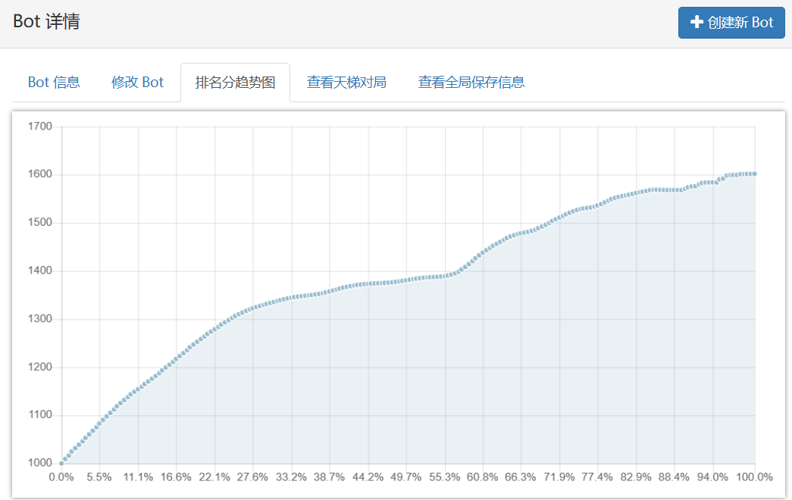
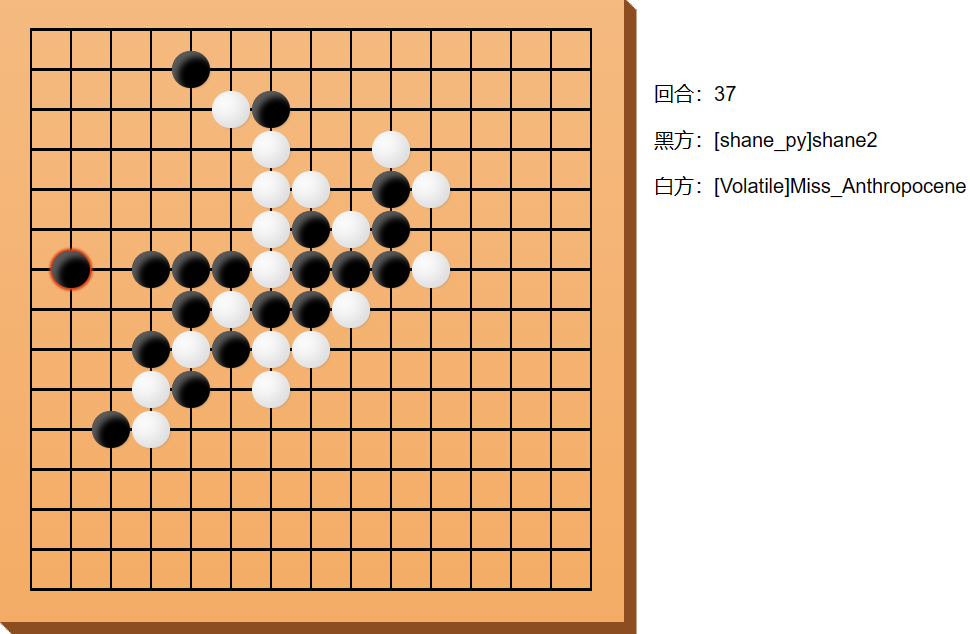

# Gomoku
A gomoku player via MiniMax Search and Alpha-Beta Pruning, running on https://botzone.org.cn/.

[](./images/rating.png)
[](./images/game.png)

## How to use
```bash
mkdir build
cd build
cmake ..
make
./gomoku
```

## Techniques
- MinMAX with Alpha-Beta Pruning.
- Zobrist.
- Transposition Table.
- Iterative deepening.

## Sample Matches
### 1s Time Limit
https://botzone.org.cn/match/65cf3f5013e80a09c4f159fb <br>
https://botzone.org.cn/match/65d15e8f13e80a09c4f2f5c1 <br>
https://botzone.org.cn/match/65d07c2b13e80a09c4f23bf4 <br>

https://botzone.org.cn/match/65d36230d43a1d5f79e90cef <br>
https://botzone.org.cn/match/65dddd88d43a1d5f79f1e2ac <br>

### 6s Time Limit
https://botzone.org.cn/match/65d4a70cd43a1d5f79ea2552 <br>
https://botzone.org.cn/match/65d4aa05d43a1d5f79ea273b <br>
https://botzone.org.cn/match/65e2c097e7439a290b613f52 <br>
https://botzone.org.cn/match/65e26df8e7439a290b6112d8 <br>

https://botzone.org.cn/match/65d94f58d43a1d5f79ee36fd <br>
https://botzone.org.cn/match/65dbec4fd43a1d5f79f06aed <br>


